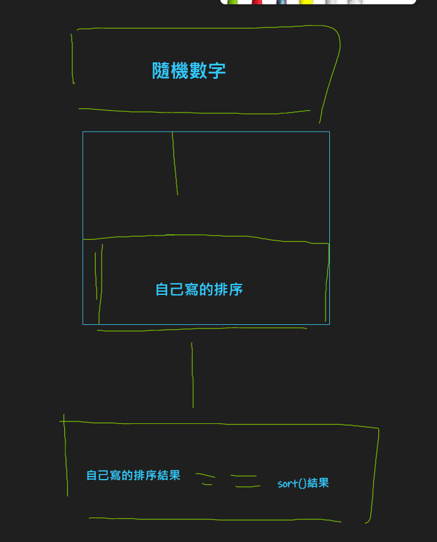

# L1 測驗

---

測驗 (1)

選擇排序

題目:

  數列分成 1.已排序 2.未排序

  從未排序找出最小放入已排序的

測驗 (2)

插入排序

題目:

  數列分成 1.已排序 2.未排序

  逐一從未排序資料一筆一筆的放入已排序的正確位置

要求:

  自己產生隨機資料

  設計 15 ~ 20 長度的測驗資料 數字介於 1 ~ 100

  每一種長度的測驗資料 產生1次 

  並測驗自己的程式碼正確性

'