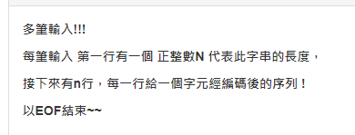
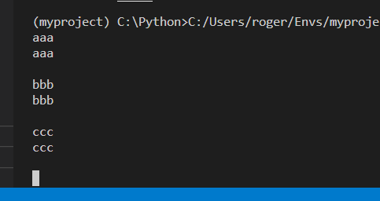
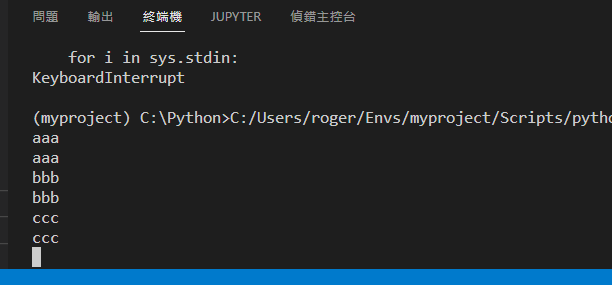

# Python I/0

## 前言

有時候會遇到題目輸入格式是多筆測資的，直到EOF結束。

例如

https://zerojudge.tw/ShowProblem?problemid=e283



有兩種方式解決，第二種速度比較快，所以遇到TLE時可以換試第二種。

## 1. while

使用 while True，做到無限循環，利用try....except來捕捉EOF輸入，執行break跳出迴圈。

``` python
while True:
    try:
        '''
        code
        '''
    except:
        break
```


以上面的圖片的輸入格式寫成以下程式碼

``` python
while True:
    try:
        n = int(input())
        for i in range(n):
            a = input()
    except:
        break
```


## 2. sys.stdin

使用sys.stdin，來達到輸入功能。

因為 sys.stdin是一個文件對象，所以可以迭代，效果是獲取每一行的輸入(包含換行符)，直到遇到EOF結束。

``` python
import sys	#必須先匯入sys
for i in sys.stdin:
    print(i)
```



可以看到每一次印完都會多一行，這時我可以使用.rstrip()來消除。

``` python
import sys	#必須先匯入sys
for i in sys.stdin:
    print(i.rstrip())
```



以上面圖片的例子，我們可以使用 for i in sys.sdin來獲取每一筆測資的第一行，之後的n行使用readline()來獲取整行輸入。

``` python
import sys
for j in sys.stdin:
    for i in range(int(j)):
        a = sys.stdin.readline().strip()
```


