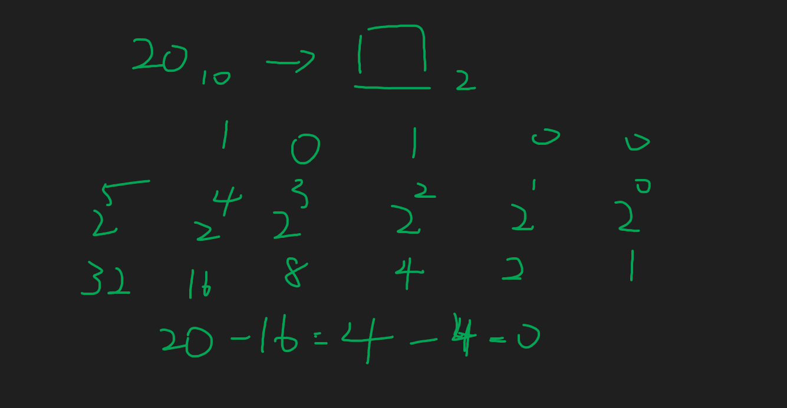
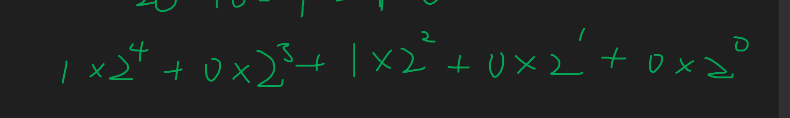

# 前言

按照課程給的題目練習，全部都做完，並且搞懂，理論上觀念題4級分起跳，但是可能有些範圍外的知識點沒有上到，所以導致要考到五級分比較難，所以老師看了許多"熱心"的網友提供的筆試題，整理出一份可能會考但沒有學過的知識點，幫助同學達到五級分。

# 進制轉換

## 10進制轉X進制

EX. 20 的10進制轉成2進制

列出不大於 20 ，2的次方所有數字，按照大到小依序"湊滿" 20。

同學可以試著想想如何寫成程式碼。

## X進制轉10進制

按照剛剛的圖，乘回去即可。

