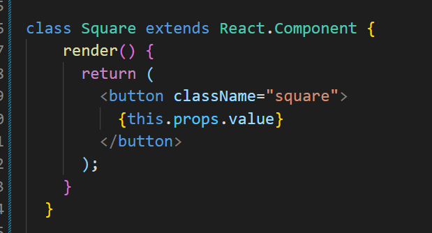

# React學習指南

https://zh-hant.reactjs.org/tutorial/tutorial.html

## 1. 建立本地環境

### 1.

## 2. Prop傳遞資料

​	資料可以從board傳遞到square，藉由this.props拿到

## 3.建立互動式

### 1.點擊事件

### 2. component使用state紀錄

使用constructor設定this.state

constructor 在render執行前建立

