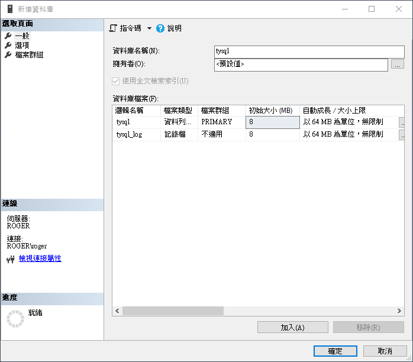

# SQL 學習

## 前言

書本: SQL必之必會

為了練習書本例題，先下載腳本創建

https://forta.com/wp-content/uploads/books/0672336073/TeachYourselfSQL_MicrosoftSQLServer.zip

### 1. 建立資料庫

### 2. 新增查詢

### 3.貼上網址提供的create裡的內容，創建表

### 4. 寫入數據

### 5. 測試

## 1.排序檢索數據

在DBMS裡面我們不應該假定認為檢所出的數據是有排序的。

### 1. 排序數據

使用ORDER BY進行排序，此子句要在最後一條子句。

### 2. 按多列進行排序

### 3. 融合降序排序

先按照price價格由高到低，再以名稱a~z排序

## 2. 過濾數據

### 1. 使用where子句

### 2. where 子句操作符

每一個DBMS可能不太一樣

#### 1. 判斷字符串

​	查找指定id

​		

####2. 範圍值檢查

使用BETWEEN操作符

​	

