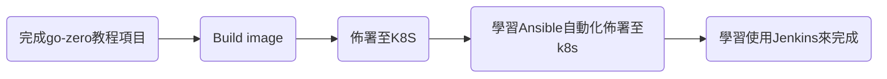

# 3 個月紀錄

---

# 1/16

查找資料，確定項目目標，架構，工具

https://zhuanlan.zhihu.com/p/533963316 整體項目架構參考此網站

雲端基礎設施: kubernetes

微服務架構:

.assets\image-20230116125158095.png)


整體來說有6個種類的組件構成微服務架構

1. 微服務
2. 註冊中心 Microservice registration center
3. 監控系統 Metrics
4. 日誌系統 Logging
5. 追蹤系統 Tracing
6. 流量控制 Sentinel 

應用程式實現目標

​	` 秒殺系統` (暫定)

技術選型 :

1. 微服務
   1.  程式語言 Golang 
   2.  後端框架 gin + gorm
   3.  緩存 redis 
   4.  資料庫 mysql
2. 註冊中心: Nacos
3. 監控系統: Prometheus + Grafana
4. 日誌系統: Kafka 
5.  追蹤系統: ZipKin
6. 流量控制 Sentinel
7. CI/CD: Jenkins
8. 自動化腳本 Ansible

## 基本流程學習

預估時間 1/16 ~ 1/29




時間預估: 預計3/3日完成

工作時間:

預計開發週期 

1. 1/30 ~ 2/3

2. 2/6 ~ 2/10

3. 2/13 ~ 2/17

4. 2/20 ~ 2/24

5. 2/27 ~ 3/3

   共 25天 

##　go-zero

生成api 代碼

``` shell
goctl api go -api <filename.api> -dir .
```


---

# 1/18


## Problem 1

### 問題:　在docker執行的服務無法連線到，wsl2的mysql


SHOW VARIABLES LIKE 'bind_address';

---

# 1/19

jenkiins 工作路徑 ` /var/lib/jenkins/workspace/`

代碼覆蓋率（Code coverage） : codecov

---

# 1/30

##　Problem1 Solved

### 問題:  在docker執行的服務無法連線到，wsl2的mysql

.assets\image-20230130111516990.png)

## 解決問題:

 docker裡面的容器不是使用與主機相同的網卡，所以屬於外部網路，所以必須服務的mysql ip 位置要設置成外部ip 192.168.x.x，

.assets\image-20230130112236231.png)

後來查詢才知道mysql在每個帳號都會設定允許訪問的網段

.assets\image-20230130112352742.png)

知道 root這個user允許的host只能是 localhost，所以只須建立新使用者並把允許的host設成 容器的ip或是 '%' (代表允許任何網路)

``` sh
CREATE USER 'roger'@'%' IDENTIFIED BY 'roger';
FLUSH PRIVILEGES;
```

以上。


## 單元測試和集成測試

閱讀

https://medium.com/@victorsteven/understanding-unit-and-integrationtesting-in-golang-ba60becb778d

初步了解如何撰寫單元測試和集成測試

目錄: wsl2 /home/roger/code/efficient-api

---

# 1/31


## 介面 Interface

.assets\image-20230131171424377.png)

這段函式主要接收 rest api ，功能為 新增使用者，28 ~ 39 主要為接收並解讀要新增的使用者名稱及密碼，存到user 的 struct

第 40 行為 主要功能代碼，呼叫 新增使用者的 function，裡面會先檢查使用者存不存在，不存在才新增該使用者，因為涉及到資料庫操作，我這邊傳入資料庫的實體。

這邊我們嘗試以測試的角度去想如何測試該程式碼，我們寫測試代碼時並不會執行整個專案，這裡的db實體是一個global，所以這裡測試會出問題，必須把把傳入db實體的部分從參數拿掉，而是讓這個函式是服務於db的，先有db才有這個服務，再來重寫這邊程式碼時要考慮到 creatuser這個服務 跟你用哪種db應該要沒關希，所以這邊也必須跟db解偶，所以既要服務於db又要與db解偶，就可以使用interface

---

# 2/2

使 RUN ls 能顯示在console

```sh
docker build -t tm-user --progress=plain --no-cache .  
```

---


# 2/9

## 實驗 建立kubeconfig，使外部kubectl可以操作集群

---


# 2/10

## Problem2

## 問題: 無法連線到ingress匹配的url

 .assets\image-20230210162719303.png)

## 解決問題

原因:

沒有了解ingress的整體原理

.assets\image-20230210163618500.png)

源自: kubernetes in Action

Ingress的功能是藉由兩個東西做到的，

1. Ingress
2. Ingress controller

Ingress 主要是用來記錄匹配規則，而Ingress controller主要是用來監聽Ingress的變化，並負責找到該服務的endpoint，並導到該pod，所以我們實際上必須要連到Ingress controller並喂給他url。
查看 Ingress controller 的 pod

.assets\image-20230210164315251.png)

我們可以看到他實際上由 ReplicaSet控制，所以通常會有service負責找到該pod

.assets\image-20230210164427972.png)

我們可以看到該服務屬於NodePort類型，代表該service是綁定在集群的30020端口 or 32497端口
所以連到該服務時必須指定端口

.assets\image-20230210164931995.png)

---


# 2/13

## 秒殺系統業務設計

1. 發起請求
2. 查看庫存
3. 下訂單

---

# 2/16

## 代辦事項

- [ ] 私有化鏡像倉庫，並配置Secret給ServiceAccount

---

# 2/17 

## 加入新節點印出指令

``` sh
kubeadm token create --print-join-command
```

# 2/18

## Problem3

## 問題 在k8s上面的Jenkins 無法解析 updates.jenkins.io 域名

.assets\image-20230218152531449.png)

---

# 3/6

## 解決問題 3

此問題代表 jenkins無法更新插件

.assets\image-20230306134505662.png)

我們嘗試 進入 jenkins pod 執行，

.assets\image-20230306134943229.png)

無法成功。

kubernetes 解析域名的流程是

查看本地dns -> CoreDns -> 上游DNS

若是CoreDns出現問題，可能連Service都無法運作，先排除CoreDns本身的問題，問題鎖定到上游DNS配置，查看CoreDns配置

``` shell
apiVersion: v1
data:
  Corefile: |
    .:53 {
        errors
        health {
           lameduck 5s
        }
        ready
        kubernetes cluster.local in-addr.arpa ip6.arpa {
           pods insecure
           fallthrough in-addr.arpa ip6.arpa
           ttl 30
        }
        prometheus :9153
        forward . /etc/resolv.conf {
           max_concurrent 1000
        }
        cache 30
        loop
        reload
        loadbalance
    }
kind: ConfigMap
metadata:
  creationTimestamp: "2023-02-08T07:31:19Z"
  name: coredns
  namespace: kube-system
  resourceVersion: "4513812"
  uid: d0f05e9d-9af2-4d0d-808a-152ed195905c
```

可以看到這行 ` forward . /etc/resolv.conf { ` ，該策略表示上游的Dns 會轉到 /etc/resolv.conf 鎖記載的位置，這檔案裡面的內容由 pod 的 dns策略所訂 **dnsPolicy**:

.assets\image-20230306140800495.png)

https://kubernetes.io/zh-cn/docs/concepts/services-networking/dns-pod-service/

那這邊比較需要注意的是 這個 字段 是有默認值得，這也是為什麼 我們創建pod時不會特別去寫，

默認值是 `ClusterFirst` 就是CoreDns Service的位置

那CoreDns 的策略是 `Default` ，也就是繼承自所在的節點。

### 問題鎖定

問題可能的原因，猜測大概率是 我們無法連接到上游dns

查看pod節點上預設dns服務器位置

.assets\image-20230306145200253.png)

每一個節點的預設dns 都是 `192.168.111.51` 

我先隨便起一個pod ，然後ping ping 看

.assets\image-20230306145440568.png)

會一直卡在這邊，顯然我 ping 不通。

所以到目前為止知道問題的根本原因，是因為 上游的DNS 無法抵達 倒置解析域名失敗 。

這邊嘗試 ping 外網的dns

.assets\image-20230306145716349.png)

顯然是有對外連線的能力，所以最快的解決方案就是 把 上游的dns改成 8.8.8.8

### 解法 1 直接修改上游dns 位置

配置coredns 的 ConfigMap ，把 forward 設定成指定dns

.assets\image-20230306150134065.png)

抓取google頁面成功

.assets\image-20230306150235993.png)

jenkins 隨便下載一個 plugin

.assets\image-20230306150415575.png)

至此問題得到解決，但是這有解釋之前為什麼無法ping通

### 追根究柢

我們嘗試在節點上確認 `192.168.111.51`  是可以ping，並且能正確解析域名

.assets\image-20230306150819271.png)

也就是 

pod 無法到  `192.168.111.51` 

但主機可以 

但是 pod 又可以 ping 通外網

 .assets\image-20230306151411009.png)

pod 和 node 的唯一差別在於 源 ip 不一樣，所以我推測

### 推測原因 封包回不來

我猜測 封包有正確找到 192.168.111.51

但是回不來，

node的 ip 是 10.250.75.102 

pod 的網段是 192.168.0.0/16

.assets\image-20230306151837972.png)

回來的路由表 可能不認識   192.168.0.0/16 ，或者衝突，有待確認。

照理來說，pod出來的數據包都會經過snat轉換，我們可以利用

tcpdump + wireshark 來進行抓包分析

我們 在 pod ping 8.8.8.8 及 192.168.111.51

根據路由表 會走 `ens192`

.assets\image-20230306155423673.png)

.assets\image-20230306160453425.png)

我可以發現 只要是 ping 8.8.8.8 源地址都會轉換成 10.250.75.139

但是 ping 192.168.111.51 就不會轉

https://docs.tigera.io/calico/3.25/networking/configuring/workloads-outside-cluster

從官網得知， calico 只要是 屬於集群內的ip 都不會進行snat轉換

### 解法 2 手動添加iptable規則 ，利用SNAT更改源地址

``` sh
iptables -t nat -A POSTROUTING -d 192.168.111.51 -s 192.168.0.0/16 -o ens192 -j SNAT --to-source 10.250.75.139
```

-d : 目的地址

-s: 源地址

-o: 網卡

--to-source : 轉換地址

.assets\image-20230306162529172.png)

.assets\image-20230306163135691.png)

成功轉換

缺點: 理論上我們不能限定 pod 的所在節點，所以就必須在coredns所在的節點加入這條規則 

---

# 3/10

## Prometheus

### 監控項目

1. node
   1. 主機負載
   2. CPU 使用率
   3. 內存使用率
   4. 存儲空間
   5. 網路吞吐
2.  集群服務質量
   1. Kubernetes API 響應時間
   2. Pod啟動時間

黑盒監控: 現象、用戶角度，能隊正在方生的故障進行告警

* Service
* Ingress

白盒監控: 原因、系統內部暴露的指標

* Node
* Container
* Pod
* 組件

# prometheus-operator

https://github.com/prometheus-operator/prometheus-operator
