查看所使用的 kind 屬於哪一個 apiVersion

kubectl api-resources

查看所有的支援的資源

kubectl log


試試看探針


# 網路

## ARP

一個封包需要兩個東西才可以到達目的地

IP + MAC

也就是說當我只有IP時，封包是無法發送出去的，需要有MAC。

通常會先查詢本地ARP緩存

1. 找到MAC，封包發送
2. 找不到MAC，發送ARP請求，也就是ARP廣播以此找到對方MAC。

可是如果目的IP不再局域網裡怎麼辦?

這個時候MAC地址就會先使用網關MAC代替，這之後的MAC都是由你的下一跳的MAC地址來替代。

### Proxy_ARP

proxy_arp是一個可選功能，也就是可以選擇開啟或不開啟，如果不開起就沒有proxy_arp的功能(廢話)

說說為什麼需要開啟proxy_arp
我們都知道數據包需要封裝鏈路層訊息，也就是MAC地址。
所以電腦在封裝MAC時會根據路由表的下一跳來決定封裝的MAC地址，所以當電腦的ARP緩存裡沒有MAC時，他會發送APR請求，請求 指定 IP 的MAC地址，通常是網關。
這裡分成兩種狀況

1. 網關存在

   ​	網關存在很好啊，直接回覆MAC地址。

2. 網關不存在

   ​	也就是說你訪問的IP是虛擬的，沒有人認識這個IP。

   ​	所以就產生了一個問題，因為沒有人是這個IP，是不是也就沒人響應，你就會永遠拿不到MAC地址 ?

   ​	這時候 Proxy_arp就派上用場了，如果某台(路由器、網關...)有開啟 Proxy_arp，就會代理回復MAC地址。

### calico

我們來從數據包的發送來了解calico的網路架構，

``` SH
ping 8.8.8.8
```

數據包會先經過封裝才能發送出去，封裝的過程中有一個階段是封裝鏈路層，也就是封裝MAC地址，這個MAC地址是根據你的目的去匹配路由表來決定的，我們查看路由表
``` shell
route -n
```

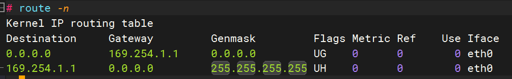

根據路由表會匹配到 `169.254.1.1` 這個地址，假設這時沒有ARP緩存，那這時就會發送ARP請求，但是你會發現這個ip地址根本是假的，沒有東西代表這個ip地址

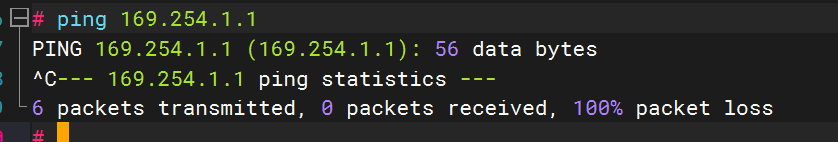

也就是根本沒有 `169.254.1.1`這個網關，那這樣數據包不就沒辦法封裝?
但網路是正常的，代表數據包一定有封裝，我們可以嘗試對  `169.254.1.1` 發送arp請求

``` sh
arping 169.254.1.1
```

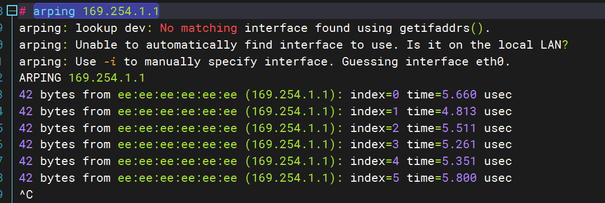

是有響應的!! MAC地址是一個無效地址，這代表有某個東西開啟了Proxy_arp，他響應了我們的arp

查看接口

``` sh
ip link
```

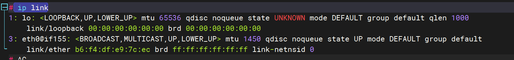

我們從路由表可以得知，我們的arp請求是由透過`eth0`發送，而這個`eth0`實際上是一個veth pair，我們可以看到 街口名稱有一個 if 155 ，155代表另一端的接口的編號，我們回到宿主機上查看

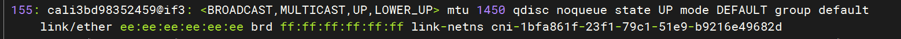

確實有這個編號，並且的也對應了 `3` 這個接口編號，我們查看此端口是否開啟Proxy_arp

``` sh
cat  /proc/sys/net/ipv4/conf/<interface name>/proxy_arp
```

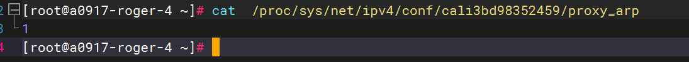

確實開啟了 proxy_arp，使得我們的數據包可以拿到這個接口的mac地址。


在calico的網路下，我們的每個pod都是藉由 veth pair 跟節點的 networknamespace 連結的，而 pod 裡面是沒有網關的

，取而代之的是使用 `Proxy_arp`，這使得就算沒有網關也能正確響應arp請求。

當封包進入到節點時，根據路由表找到對應街口，進入街口就能順利抵達目的地而不需經過網關。

也就是說 MAC地址一點也不重要，我們可以看到所有的街口的MAC地址都是無效的

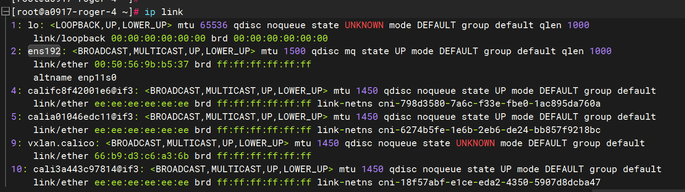

cali開頭的都是veth pair ，名稱後面的if 3，這個數字可以在對應的pod裡找到

我們可以看到所有的veth pair都是 'ee:ee...'無效的地址

而我們可以進一步看到所有的veth街口都開啟了 Proxy_arp。

---

## POD

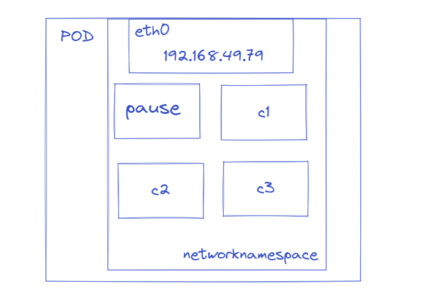

pase容器負責創建netns[^1]，而同樣是在這個pod裡的其他容器則是加入這個netns以實現網路共享，這樣就可以

使用本機端口進行訪問了。

[^1]: 網路命名空間，NetworkNamespace


---

## VXLAN

### 問題:  如果有多台同屬二層交換機，發送ARP請求，會觸發 Flooding

可能會造成網路壅塞，這時需要劃分廣播域，以用來限制Flooding的範圍。

#### VLAN

在交換機裡設置VLAN可以劃分不同的廣播域，也可以藉由 Trunk Link 的方式 讓不同的交換機但屬於同一個VLAN互相

通信。

#### VXLAN

無關物理配置，在三層的基礎上實現二層廣播域劃分廣播域劃分。

# 3/25 ??Calico 網路實現不太一樣

---

# 安全

## TLS

### 加密技術

1. 對稱加密
2. 非對稱加密

### 對稱加密

密鑰: K , 文本 M

```
C = E(M, K) # (加密文本)
M = D(C, K) # 解密文本
```

問題:  密鑰傳輸問題，無法識別對方是否為合法對象，以及每一個傳輸都要產生唯一一把密鑰。

### 非對稱加密

發送方: S, 接收方: R, 公鑰: P, 私鑰: C, 文本 M

```
R 傳送 P 給 S
ET = E(M, P)
M = D(ET, C)
```

訊息經由 P 加密，只能由 C 解密，訊息只能單向傳遞

問題:  中間人攻擊， 在R 傳送 P 給 S時， P在傳送時被截取並被中間人掉包，中間人先產生自己的RSA (P2, C2)，並用 P2 掉包 P，使得 S 拿到的是 P2，當 S 使用 P2 加密文本並傳送時， 中間人獲取 即可用C2解密，也可能在解密完時修改文本，並重新用 P 加密 ，再傳送至 R。

### 數字簽名和 CA

解決中間人的問題在於 S 必須確定拿到的 P 是 R的，使用數字簽名技術。

#### 數字簽名:

發送方: S, 接收方: R, 公鑰: P, 私鑰: C, 公信力: CA, 數字簽名 sig, 身分證申請: CSR

``` sh
1. R: CSR = P + ID	#R 把 ID(身分證或域名) + 公鑰 合為身分證申請
2. CSR --> CA 		# R 把 CSR 傳送給 具有公信力的人
3. sig = E(CSR, CA.C)# CA 使用 私鑰 加密 CSR 得到 數字簽名
4. CRT = CSR + sig 	# CA 合併 CSR + sig 稱為 CA簽署的身分證CRT 發給 R
```

當 S 要發送訊息給 R時，S 必須確認 對方是 R ， 所以:

``` sh
0. 前提是 S 要 安裝跟 R 一樣的 CA 的 CSR
1. R 傳送R.CRT給 S	# R.CRT: R 的 CRT
2. R.CSR = D(R.CRT.sig, CA.CSR.P)	#使用 CA CSR裡的公鑰解密 R CRT裡的 sig，獲取CSR
3. 解密出來的CSR == R.CRT.CSR	# 判斷解密後的CSR 和 CRT裡面的名文CSR是否一樣
4. 一樣表示 這個 R 的 CRT是 CA 認證過的
```

#### 信任鏈

#### 根身分證和自簽名

我們可以自己建立CA，也就是自己簽名，需要的東西可以根據上述過程得知:

1. CA.P , CA.C 公鑰, 私鑰
2. CA.CSR
3. CA.SIG 
4. CA.CRT

#### 元素

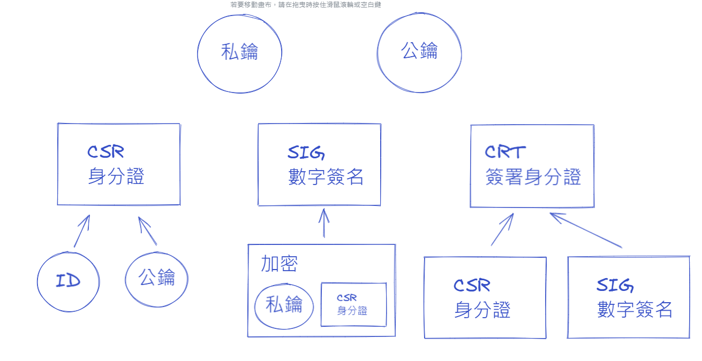


### 參考來源:
[TLS](https://github.com/k8sp/tls)


---


# 常用指令

## 印出加入worker node

``` sh
kubeadm token create --print-join-command
```

## 印出加入control-plane

``` sh
kubeadm token create --print-join-command --certi


ficate-key `kubeadm init phase upload-certs --upload-certs | awk 'FNR == 3 {print $1}'`
```

## 連線到etcd

``` sh

ETCDCTL_API=3 ./etcdctl [global options] command [command options] [arguments...] \	#必須要在有etcdctl客戶端的情況下執行
  --endpoints=https://127.0.0.1:2379 \
  --cacert=/etc/kubernetes/pki/etcd/ca.crt \
  --cert=/etc/kubernetes/pki/etcd/server.crt \
  --key=/etc/kubernetes/pki/etcd/server.key
```

## kubernetes 組件的 靜態pod路徑

``` sh
ls /etc/kubernetes/manifests
```

## 列出linux命名空間

列出所有命名空間

``` sh
lsns
```

列出網路命名空間

``` sh
lsns -t net
```


# Debug

## 從 HA Kubernetes刪除主節點

使用 kubectl delete node <node name> ，記得etcd也要刪除。


# TROUBLESHOOTING

## OOM

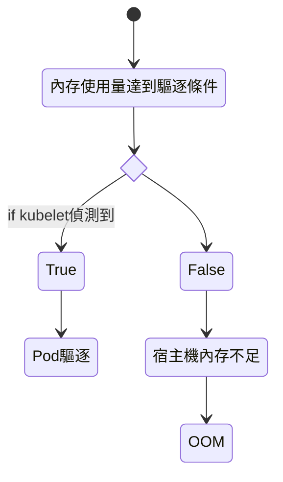

[Kubernetes Pod 驱逐详解](https://icloudnative.io/posts/kubernetes-eviction/)

### 實驗

*OOM killer*  pod 優先級

`BestEffort` > `Burstable` > `Guaranteed`

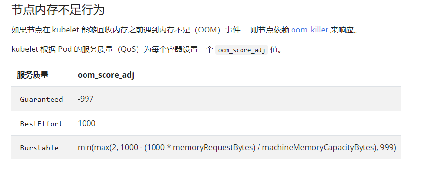

[节点内存不足行为](https://kubernetes.io/zh-cn/docs/concepts/scheduling-eviction/node-pressure-eviction/)

[kubelet 驱逐时 Pod 的选择](https://kubernetes.io/zh-cn/docs/concepts/scheduling-eviction/node-pressure-eviction/#kubelet-%E9%A9%B1%E9%80%90%E6%97%B6-pod-%E7%9A%84%E9%80%89%E6%8B%A9)

oom 訊息是由 kubelet的 cadvisor 獲取

有可能 cadvisor 獲取不到 oom，這時只能查看 linux 內核日誌

``` sh
cat /proc/kmsg
```


# 資料來源

[Calico 网络通信原理揭秘](https://zhuanlan.zhihu.com/p/75933393)

[Tracing the path of network traffic in Kubernetes](https://learnk8s.io/kubernetes-network-packets)

