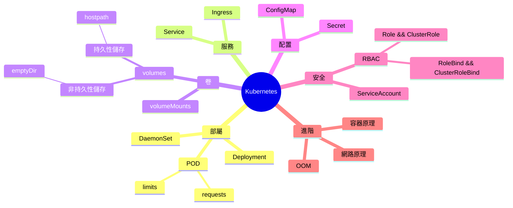

```mermaid
mindmap
root((Kubernetes))
	部屬
		POD
			requests
			limits
		Deployment
		DaemonSet
	服務
		Service
		Ingress
	卷
		volumeMounts
		volumes
			非持久性儲存
				emptyDir
			持久性儲存
				hostpath
	配置
		ConfigMap
		Secret
	安全
		ServiceAccount
		RBAC
			Role && ClusterRole
			RoleBind && ClusterRoleBind
	進階
		網路原理
		容器原理
		OOM
```

k8s: 容器編排系統

pod -> cri -> runc

pod: 2個容器以上， 

docker file -> dokcer hub

