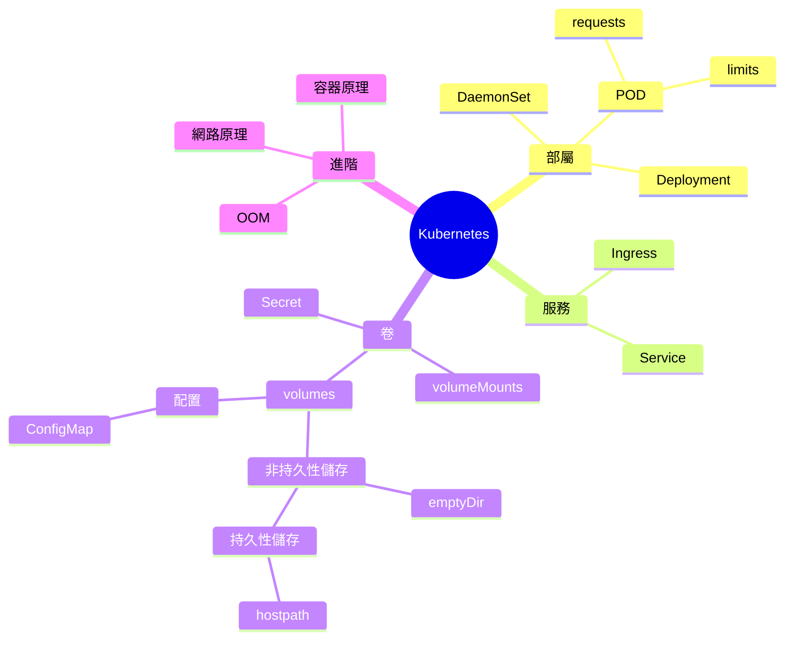

# Kubernetes知識點

---

## Kubernetes Resource

### POD與Container

#### Container

##### 探針

1. 存活探針
   1. 命令
   2. HTTP
   3. TCP
   4. gRPC
2. 就緒探針
3. 啟動探針

---

### Deployments

---

### Service 

#### 端口類型

port

targetport

#### 發布

---

### Job & CronJob

Job 一次性任務

CronJob 定時性任務

---

### Volume

非持久性儲存

​	emtyDir

持久性儲存

​	hostPath

## Operator

1. 研究 

   思考能做的例子，網路上查查發現大多開發operator都是為了解決有狀態服務，所以我就在想operator具體解決了什麼樣的問題，根據這個思路，我就連想到之前有跟你提到的，最終負載的地方終究是數據庫，所以延這個思路我就查到如何擴展數據庫的使用方式，目前大體上有兩種解決方式。

   1. 垂直擴展 根據服務進行拆分
   2. 水平擴展 我目前只想的到使用會員編號的方式進行水平拆分

   所以重點關注在水平擴展上，因為垂直擴展可能無法很好的分配負載，我能想到operatory在這邊的解決方案就是擔任 自動擴編，自動導向等等，但具體上還是很模糊所以才會萌生出想找你討論的想法。

   這些有問過主管，但他回了我說要是某個db死了，不就出問題了@@

   但我心裡想的是說 這也能套到現在情況阿，現在的情況不也是db死了全部都死了，所以這邊可以研究的點是db自動備份。

2. 不研究operator 

   1. 我會想知道現實狀況上會遇到什麼樣困難的點，因為就我目前認識到的k8s 寫好 deployment (加個探針之類的，service ，用ingress對外網關) 的yaml檔就好了? 或許以實際碰到的服務來撰寫這些yaml檔才是難處? 如過是這樣的話 我就會需要常識部屬你們的專案，但你說 不要部屬github上的專案@@

   2. 準備 cka

      

1. Golang程式build完打包成image，可以在container上執行
2. 學習使用ansible自動化佈署到k8s
3. 使用Jenkins 完成 build -> image -> push docker hub -> 調用ansible自動佈署到k8s 

---

