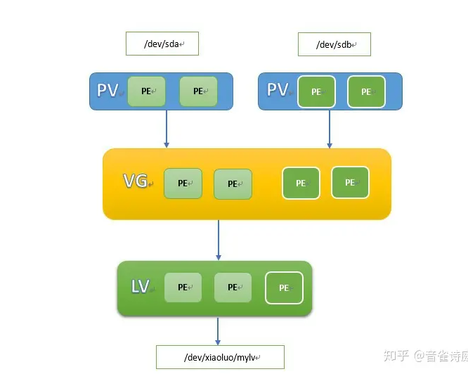
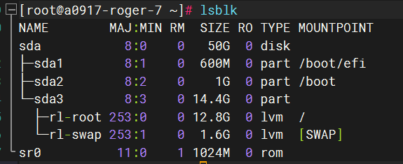
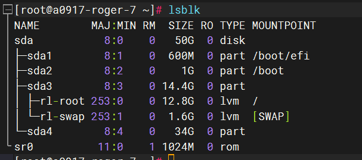
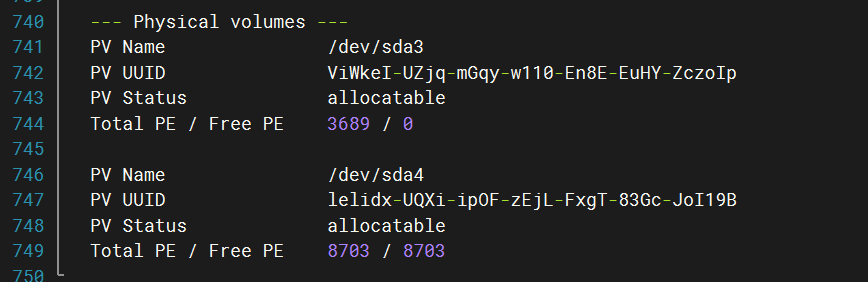
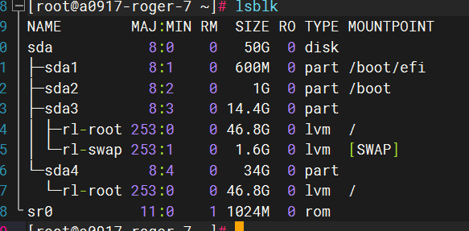

 # MySQL

## MySQL 安裝方式

ubnutu

```sh
	sudo apt update
	sudo apt-get install mysql-server
	cat /var/log/mysql/error.log	#查看建立的密碼
	sudo mysql -u root
	ALTER USER 'root'@'localhost' IDENTIFIED BY 'roger';	#更改密碼

```

## MySQL 配置新使用者並設定允許連線 IP

``` sh
# 設定 mysql 對外開放端口 
 sudo vi /etc/mysql/mysql.conf.d/mysqld.cnf
 # 該改 bind-address: 0.0.0.0
CREATE USER 'roger'@'%' IDENTIFIED BY 'roger9491';	#建立用戶 %: 對所有ip開放
ALTER USER 'roger'@'%' IDENTIFIED WITH mysql_native_password BY 'roger9491';
# 更改認證方式

# 更改用戶權限
GRANT ALL PRIVILEGES ON *.* TO 'roger'@'%' WITH GRANT OPTION;
FLUSH PRIVILEGES;

```

# Kafka

## Linux

### 啟動方式

``` sh
# 安裝玩 kafka
cd kafka_2.13-3.4.0
# 啟動 zookeeper
bin/zookeeper-server-start.sh config/zookeeper.properties 
#　啟動 kafka
bin/kafka-server-start.sh config/server.properties 

```

## [創建一個主題來存儲您的事件](https://kafka.apache.org/documentation/#quickstart_createtopic)

``` sh
# kafka 把傳入的事件組織成 topics， 類似於文件夾

# 因此在編寫一個事件之前，必須先創建一個主題
bin/kafka-topics.sh --create --topic quickstart-events --bootstrap-server localhost:9092
# --create: 創建主題
# --topic: 命名主題
# --bootstrap-server: 指定kafka broker 地址

# 顯示 topic 詳細訊息
bin/kafka-topics.sh --describe --topic quickstart-events --bootstrap-server localhost:9092

# 啟動一個生產者的控制台，用於將輸入的消息發送到指定的 topic
bin/kafka-console-producer.sh --topic quickstart-events --bootstrap-server localhost:9092	# 輸入的每一行都會發送到 topic

# 啟動一個消費者的控制台，用於查看指定的 topic裡的消息
bin/kafka-console-consumer.sh --topic quickstart-events --from-beginning --bootstrap-server localhost:9092

# 該事件會永久儲存到 topic 裡面
```

## Kafka 配置

### 自動創建主題

```sh
vi ./config/server.properties

#找到 或 在最下面添加
auto.create.topics.enable='true'
```


## Kafka Connector

### De

# Linux

## Resize Boot Disk



1. PE 物理拓展
2. PV 物理捲
3. VG 捲組
4. LV 邏輯捲

查看空間是否有增加並檢查是文件系統是否為LVM

```sh
lsblk
```



```sh
# 建立新磁區
# 進入磁區管理交互控制台
sudo fdisk /dev/sda
#輸入
n	# 創建新分區
#剩下都輸入 enter 默認值

# 查看是否創建成功
lsblk
```



```sh
#創建 pv
pvcreate /dev/sda4
# 查看pv
pvs
# 加入 vg
vgextend rl /dev/sda4
# 查看 pv 是否有加入 vg
vgdisplay -v rl
```



```sh
# 擴充 lv
 lvextend -l +100%FREE /dev/<vg-name>/<lv-name>

# 查看是否成功
lsblk
```



``` shell
# 按照文件系統類型擴展
sudo xfs_growfs /
```

# PostgreSQL

## [安裝](https://www.postgresql.org/download/linux/ubuntu/)

## 配置

```sh
# 切換到 postgres 帳戶
sudo -i -u postgres
# 立即訪問 PostgreSQ
psql

exit
# 在  postgres 帳戶下 創建腳色
createuser --interactive

# 配置外網連結
sudo vi /etc/postgresql/<version>/main/postgresql.conf
# 找到  listen_addresses
listen_addresses = '*'

#####################
sudo vi /etc/postgresql/<version>/main/pg_hba.conf 
# 最下面增加
host    all             all             0.0.0.0/0               trust

########################
# 建立資ㄌㄧㄠ

```


