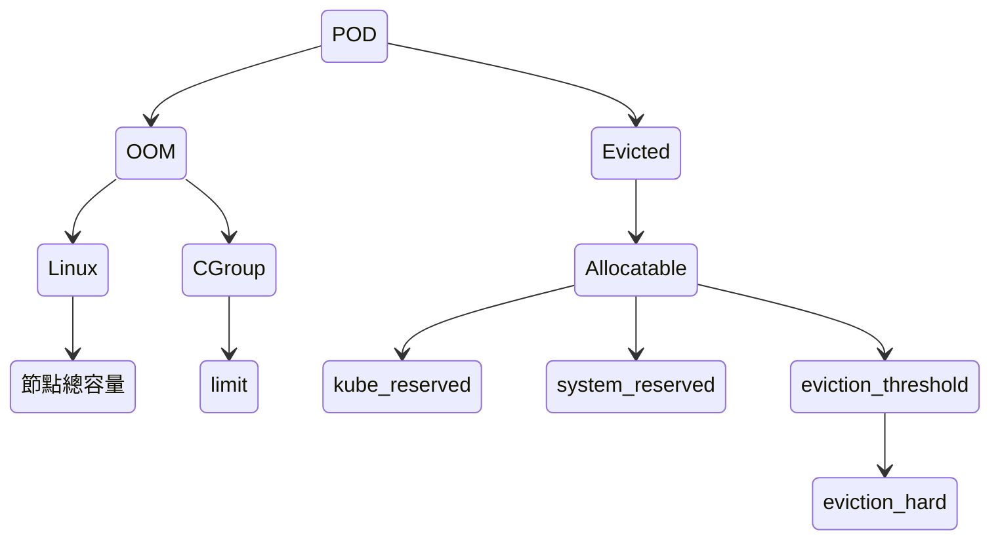
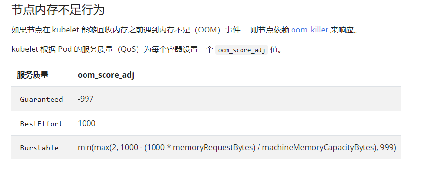
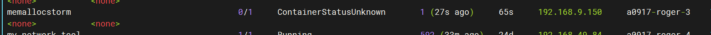
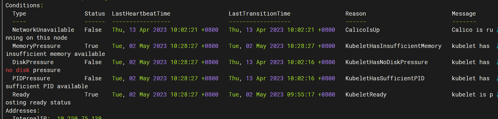
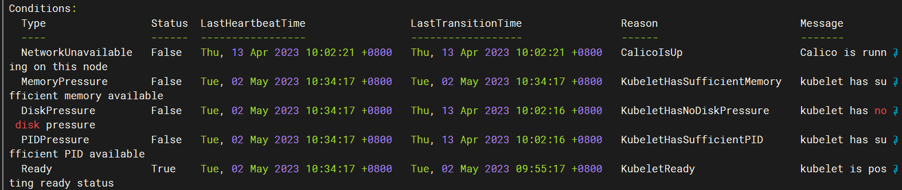

# OOM與Evicted

## Overcommit

linux 內存管理，內存地址分為 物理地址和虛擬地址，進程無法直接看到物理地址，一切使用都是向內核申請虛擬的內存區域，根據獲得的區域再依地址存放數據。

所以簡單概述進程如果需要使用到內存，會有兩個步驟

1. 申請內存
2. 占用內存

而占用內存才會實際算在已分配內存裡。

所以 `overcommit` 就是在決定申請內存的部分，具體分為三種情況 [Overcommit Accounting](https://www.kernel.org/doc/Documentation/vm/overcommit-accounting.rst)

* 0 : overcommit已啟用，但內存會拒絕明顯的過度使用
* 1:  總是過度使用
* 2:  不要過度使用(**注意使用**)

查看方式為

``` shell
cat /proc/sys/vm/overcommit_memory
```

真對模式 `2` 解釋

設置一個可申請的限制，修改 `/proc/sys/vm/overcommit_ratio` 值，系統根據公式:

```
(ratio%*物理內存) + 交換內存
```

算出可申請內存的值，可查詢

``` sh
ls /proc/sys/vm/
查看 
CommitLimit: 	可申請內存    
Committed_AS:	目前申請的內存
```


## POD 狀態圖



POD 兩種狀態

1. `OOM`

   1. `Linux`觸發的
   2. `CGroup`觸發的

2. `Evicted`

   `Allocatable` 由三個標誌所決定的

   `eviction_threshold`為 `eviction-hard `決定

## OOM

## Linux

當內存不足時 OOM會觸發，按照進程分數選擇殺掉進程

``` sh
cat /proc/<pid>/oom_score	#進程分數 
```

此分數受同即目錄下的 oom_score_adj引響，

`oom_score` = 基礎分數(會隨內存動態改變) + `oom_score_adj` 

*OOM killer*  pod 優先級

`BestEffort` > `Burstable` > `Guaranteed`



[节点内存不足行为](https://kubernetes.io/zh-cn/docs/concepts/scheduling-eviction/node-pressure-eviction/)

oom 訊息是由 kubelet的 cadvisor 獲取

有可能 cadvisor 獲取不到 oom，這時可查看 linux 內核日誌

``` sh
cat /proc/kmsg
```

## Cgroup

藉由設置 [`limit`](https://kubernetes.io/zh-cn/docs/concepts/configuration/manage-resources-containers/#example-1) 為其設置 cgroup 限制的 `memory.kmem.limit_in_bytes`

當 container 到達其限制的 `memory.kmem.limit_in_bytes  ` 即會被 OOM。

## Evicted

[kubelet 驱逐时 Pod 的选择](https://kubernetes.io/zh-cn/docs/concepts/scheduling-eviction/node-pressure-eviction/#kubelet-%E9%A9%B1%E9%80%90%E6%97%B6-pod-%E7%9A%84%E9%80%89%E6%8B%A9)

### [Node Capacity](https://kubernetes.io/zh-cn/docs/tasks/administer-cluster/reserve-compute-resources/#node-allocatable)


[kube-reserved](https://kubernetes.io/zh-cn/docs/tasks/administer-cluster/reserve-compute-resources/#kube-reserved), [system-reserved](https://kubernetes.io/zh-cn/docs/tasks/administer-cluster/reserve-compute-resources/#system-reserved): 原理是通過規定 `cgroup` 限制來實現
[參考此 cgroup 規劃](https://github.com/kubernetes/design-proposals-archive/blob/main/node/node-allocatable.md#recommended-cgroups-setup)

`Evicition-Thresholds`:  由 `--eviction-hard` 設定

我的理解是 
kubelet 藉由 cgroup 控制的是 `kube-reserved` 和 `system-reserved`，換句話說 POD 會發生 OOM的範圍(前提有設置這兩個標誌)，會是在 `Capacity` - `kube-reserved` -  `system-reserved`
，因為 [子層級的總和不能超過父層級](https://www.kernel.org/doc/Documentation/cgroup-v2.txt)(在 Allocations 的部分)，也就是說當 pod 的 memory增長範圍是有可能越界到了 eviction-threshold，這個時候如果 kubelet 沒有偵測到並 持續增長到超過`Capacity` 就會被 OOM 。


### Pod 驅逐

 `memory.available` 為當前可用的記憶體，[默認 memory.available<100Mi](https://kubernetes.io/zh-cn/docs/concepts/scheduling-eviction/node-pressure-eviction/#hard-eviction-thresholds) ，可以添加些[標誌](https://kubernetes.io/zh-cn/docs/concepts/scheduling-eviction/node-pressure-eviction/#hard-eviction-thresholds)更改其條件，總的來說當 `memory.available` 符合條件時，即會發生驅逐。


#### 驅逐根據

#### [驱逐信号](https://kubernetes.io/zh-cn/docs/concepts/scheduling-eviction/node-pressure-eviction/) 文章裡的 [腳本](https://kubernetes.io/zh-cn/examples/admin/resource/memory-available.sh) 給出了 kubernetes 是如何計算出 `memory.available`

``` sh
# 文章的公式為 
memory.available := node.status.capacity[memory] - node.stats.memory.workingSet
# 從腳本可以得知 
node.status.capacity[memory] #來自 cat /proc/meminfo | grep MemTotal | awk '{print $2}'
node.stats.memory.workingSet 
#計算自 memory_usage_in_bytes - memory_total_inactive_file
memory_usage_in_bytes #來自 cat /sys/fs/cgroup/memory/memory.usage_in_bytes
memory_total_inactive_file # 來自 cat /sys/fs/cgroup/memory/memory.stat | grep total_inactive_file | awk '{print $2}'
```


#### 驅逐發生時

當驅逐發生時，節點條件會轉換狀態 [节点条件](https://kubernetes.io/zh-cn/docs/concepts/scheduling-eviction/node-pressure-eviction/#node-conditions) ，過默認值 `5`分鐘 才會回復到原本的狀態 [节点条件振荡](https://kubernetes.io/zh-cn/docs/concepts/scheduling-eviction/node-pressure-eviction/#%E8%8A%82%E7%82%B9%E6%9D%A1%E4%BB%B6%E6%8C%AF%E8%8D%A1)，此時無法調度 POD 至 節點上。
針對`control-plane`上面 `Guaranteed` 和 ` Burstable` 的 POD 是具`node.kubernetes.io/memory-pressure` 容忍度的。[基于节点状态添加污点](https://kubernetes.io/zh-cn/docs/concepts/scheduling-eviction/taint-and-toleration/#taint-nodes-by-condition)


#####　實驗

###### 目的

實驗 當發生節點狀態轉換時，是否過5分鐘才會回復狀態

###### 實驗環境

​	k8s 集群

###### 配置

[配置kubelet](https://kubernetes.io/zh-cn/docs/tasks/administer-cluster/kubelet-config-file/)

[kubelet各項配置](https://kubernetes.io/zh-cn/docs/reference/config-api/kubelet-config.v1beta1/)

``` sh
vi /var/lib/kubelet/config.yaml
# 在每個worker 添加以下設定
#更改memory.available，其他皆為默認值
evictionHard:
    memory.available: 1Gi		
    nodefs.available: 10%
    imagefs.available: 15%
    nodefs.inodesFree: 5%
##################################
systemctl daemon-reload
systemctl restart kubelet
```

[硬驱逐条件](https://kubernetes.io/zh-cn/docs/concepts/scheduling-eviction/node-pressure-eviction/#hard-eviction-thresholds)

配置好 worker-node，檢查  Allocatable 是否下降到指定值
[查看 Allocatable 的計算方式](#Node Capacity)

###### 部屬 pod

```sh
k apply -f pod.yaml
```

``` yaml
apiVersion: v1
kind: Pod
metadata:
  name: memallocstorm
spec:
  containers:
  - name: memallocstorm
    image: aw52052001/mem-alloc-storm
    command: ['./project', 'run', 'mem', '2000']
    imagePullPolicy: Always
    ports:
    - containerPort: 80
    nodeName: 
    	a0917-roger-3 
```

```sh
command: ['./project', 'run', 'mem', '2000']
# 2000 可以修改為 想要使整體 node 記憶體到達的容量
```





5 分鐘過後




