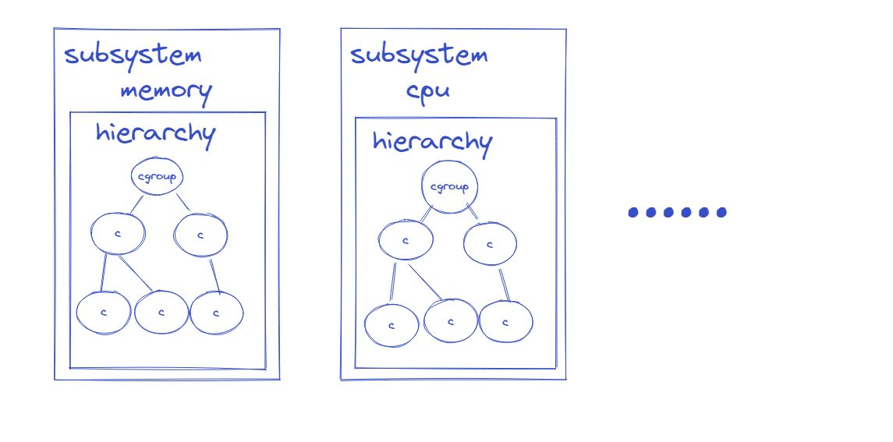

# 進入 docker

``` shell
sudo docker run -idt <image name>
sudo dockr ps
sudo docker exec -it <container id> sh
```

# 架構

## 時序圖


# Namspace

## Mount Namespace

### 理解 Mount	

``` sh
# 建立兩個目錄
mkdir test1
mkdir test2
#進入test2 並建立兩個檔案
cd ./test2	
touch f1.txt f2.txt
cd ..
# 掛載 test2 到 tes1
mount --bind ./test2 ./test2 
# 效果為 test1 的內容被替換成 test2 的內容，原本test1的內容被隱藏直到掛載消失

```


``` sh
# 分別在 test1 test2 新增文件
cd test1
touch f3.txt
cd ..
cd test2
touch f4.txt
```


可以看到從兩方視角看都新增了f3 f4，但實際上因為是 test2 掛載到 test1，所以新增的檔案實際在test2裡，這類掛載的生命週期直到重新開機就會回復。


所以 `Mount Namespace` 只是在於使用`namespace`隔離 `掛載`，當我在n1 做上述功能時，從其他 namespace 看不到掛載改變，但是看的到新增修改檔案。

``` shell
unshare --mount		# 建立 Mount Namespace，並且繼承自父進程的掛載訊息
mount --bind /usr/bin/ /mnt/ 
ls /mnt/cp 
/mnt/cp 
exit 		# 離開 Namespace
ls /mnt/cp 	# 剛剛掛載的檔案看不到了
#ls: 无法访问'/mnt/cp': 没有那个文件或目录 
```


# cgroup




## 實施資源限制

原理: 在linux裡的每一種資源代表一種subsystem，而每一種subsystem都會有一個默認的hierarchy，

我們只需要在要限制的subsystem下建立cgroup，然後修改在cgroup裡面的配置文件，並把進程加入

tasks即可完成控制。

流程圖:


查看 memory 預設hierarchy路徑

```sh
mount | grep memory
```


# 常用命令

## 查看進程的namespace內容

查看指定進程的uts namespace

``` sh
readlink -f /proc/<PID>/ns/uts
```

## 查看所有進程樹

``` sh
pstree -pl
```

## 查看进程的挂载信息

``` sh
cat /proc/$pid/mountinfo
```

輸出格式:


# 備忘清單

* container 設定檔，log 是使用container name 有衝突風險

# 參考資源

[浅谈Linux Namespace机制（一）](https://zhuanlan.zhihu.com/p/73248894)
